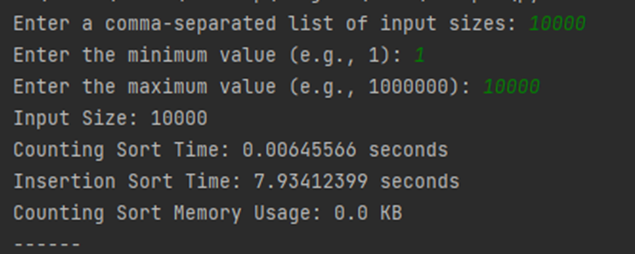
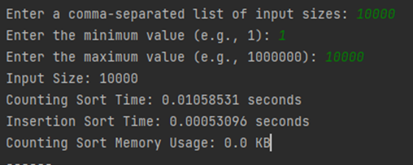

# Counting sort vs. Insertion sort

The purpose of the work is to develop counting sort algorithm and to implement it in code.
Investigate the efficiency and algorithmic complexity of counting sort and compare it with the exchange
sorting algorithm (insertion sort). Determine the advantages and disadvantages of the algorithm by comparing it with
other exchange algorithms.

## Counting sort

### Overview

Counting sort is **not** a comparison sorting algorithm and has linear complexity - **O(n + k)**. To achieve **O(n)**
complexity,
counting sort assumes that each element is an integer in the range _1_ to _k_, for some integer k and _k=O(n)_. Counting
sort
first determines for each input element _X_ the number of elements, less than or equal to _X_. Then uses this
information to
place the element of _X_ directly at its position in the original array. For example, if 15 elements are less than or
equal to X, then X belongs to the original position 15.

#### Counting sort Pseudocode

```
Counting-Sort (A, n)
1 k=MAX(A)-MIN(A)
2 Declare B[1 : n] and C[0 : k] 
3 for i = 0 downto k
4      C[i] = 0
5 for j = 1 downto n
6       C[A[j]] = C[A[j]] + l
7 for i = 1 downto k
8      C[i] = C[i] +C[i - 1]
9 for j = n downto 1
10      B[C[A[j]]] = A[j]
11      C[A[j]] = C[A[j]] – 1     
12 return B
```

### Time complexity

The for loop in lines 3-4 takes _O(k)_ time, the for loop in lines 5-6 takes _O(n)_ time, the for loop in lines 7-8
takes _O(k)_ time, and the for loop in lines 9-11 takes _O(n)_ time. Thus, the total execution time is **O(k + n)**,
where _k_ is
the range of elements and n is the total number of elements. In practice, it makes sense to use count sort when
_k = O(n)_, in which case the execution time is **O(n)**.

### Space complexity

In the above pseudocode, an auxiliary array _C_ of size _k_ was used, where k is the range of elements in this array. As
a
result, the counting sort algorithm has a space complexity of **O(k)**.

### Stability

A valuable advantage of counting sort is its stability: elements with the same value appear in the output array in the
same order as in the input array, i.e. it disassociates two elements according to the rule that the element that
appears first in the input array also appears first in the output array.

### Example

Let's consider the graphic modeling of the sorting algorithm by counting.
The [Counting-Sort (A, n)](#Counting-sort-Pseudocode)
procedure takes as input the array A=[7, 3,7, 0, 3, 2, 1, 7, 1, 1, 0] and n=11. Array C is initialized with zeros (Fig.
a) of size k - the range of elements, k=0-7 k=7. The number of identical elements from the input array A is determined
and written into the array C (Fig. b). Array C after rows 7-8 (Fig. c).


Output array B after execution of lines 9-11 after one iteration (fig.d), third iteration (fig.e), after eleventh
iteration (fig.f). Finally, the output sorted array B (Fig.g).


## Insertion sort

### Overview

Insertion sort is a sorting algorithm that places the unsorted element in the appropriate place during each iteration.
The algorithm assumes that the key element is already sorted, then selects the next unsorted element of the array. If
the unsorted element is greater than the next one, it is placed to the right, otherwise to the left. Other elements are
also sorted in this way.

#### Insertion Sort pseudocode

```
Insertion-Sort (A, n)
1 for i = 2 to n
2       key = A[i]
3       j = i – 1
4      while j > 0 and A[j] > key
5            A[j + 1] = A[j]
6             j = j - 1
7       A[j+ 1] = key
```

### Time complexity

$$
T(n) = c_1 n + c_2 (n-1) + c_3 (n-1) + c_4 \sum_{i=2}^{n} t_i + c_5 \sum_{i=2}^{n} (t_i-1) + c_6 \sum_{i=2}^{n} (t_i-1)
+c_7 (n-1)
$$
, where $c_1...c_7 number of steps

To calculate the worst case time complexity, when the input array is sorted in reverse order, we use the
decomposition of sums and after several algebraic operations we have.

$$
T(n) = \left(\frac{c_4}{2} + \frac{c_5}{2} + \frac{c_6}{2}\right) n^2 + \left(c_1 + c_2 + c_3 + \frac{c_4}{2} -
\frac{c_5}{2} - \frac{c_6}{2} + c_7 \right) n - (c_2 + c_3 + c_4 + c_7)
$$

The running time is thus a quadratic function of n.
$$
**T(n) = O(n^2)**
$$

### Space complexity

Does _not_ use additional space for sorting

### Stability

The insertion sort algorithm is a _stable_ algorithm.

### Example

The [Insertion-Sort](#Insertion-Sort-pseudocode) (A, n) procedure takes as input the array _A=[7, 0, 5, 1, 8]_ and the
number of elements in the array is n=5. The blue square holds the value of the key from _A[i]_. The blue arrows
represent
the movement of the key, the orange arrows represent the element _A[j]_.


## Comparison

1. Efficiency:

* counting sort is an algorithm with linear complexity, that is, its time complexity depends on the number of elements
  in the input array. It works very efficiently for arrays when k=O(n), k is a range of values.
  Let's give an example when _k=O(n)_ (Fig.C.1) and _k=O(n^2)_ (Fig.C.2). Execution time of the counting sorting
  algorithm
  has increased significantly, approx. **1000** times, when the value of the input array _k=O(n^2)_.

  

  Figure C.1 - k=O(n)

  

  Figure C.2 - k=O(n^2)

* insertion sorting has a quadratic time complexity, which means that its performance significantly decreases with large
  arrays (Fig. C.3).

  

  Figure C.3 - Execution time of the algorithms

2. Space complexity

* the counting sort requires additional memory for storing temporary data during sorting, namely of size _k_,
  therefore, when the range of permissible values of k increases, we have a significant amount of occupied memory (
  Fig. C.4). The graph shows the dependence of the used memory in MB to k;

  

  Fig. C.4 - Memory usage

* insertion sort does not require additional memory for sorting

3. Worst and best cases for Counting sort:

- it is not advisable to use counting sorting to sort arrays when the range of permissible values of k is much larger
  than the array itself. Let's examine the situation when the _n=1000, min=1, max=1000000_ (Fig. C.5)

  

  Fig. C.5 - Counting sort worst case

- suppose we have an array _n=1000, min=1, max=10000_, which will be the best case for sorting by
  count (Fig. C.6)

 

Fig. C.6 - Counting sort best case

4. Worst and best case for Insertion sort:

* for insertion sort the worst case is when the input array
  is [reversed](https://drive.google.com/file/d/1Pc5mZLxNQERdRimdHgJYUjJCj-IuFi-l/view) according to what it is being
  sorted (Fig. C.7), it took almost 8 seconds for insertion sort and 0.006456 in the case of counting sort.

 

Fig. C.7 - Insertion sort worst case

* the best case is when the input array is already sorted (Fig. C.8). The execution time of the insertion sort
  was _0.000531_  seconds, and for counting it was _0.010585_.

  

  Fig. C.7 - Insertion sort best case

5. Stability:

* counting sort, in its classic implementation, is stable
* insertion sort is also stable

6. Acceptable data:

- counting sort is used to sort integers. However, some changes are possible to implement the sorting of negative
  numbers;
- insertion sort can be used to sort any valid data types, as it depends on how the comparisons are defined for those
  types.

7. Sorting Algorithm Comparison

| **Algorithm**   | **Best Case Time Complexity** | **Worst Case Time Complexity** | **Average Case Time Complexity** | **Space Complexity**     | **Stability** |
|-----------------|-------------------------------|--------------------------------|----------------------------------|--------------------------|---------------|
| Counting Sort   | \( O(n + k) \)                | \( O(n + k) \)                 | \( O(n + k) \)                   | \( O(n + k) \)           | +             |
| Insertion Sort  | \( O(n) \)                    | \( O(n^2) \)                   | \( O(n^2) \)                     | \( O(1) \)               | +             |

## Conclusions

Advantages:

* Counting sort has linear time complexity: **O(n + k)**, where n is the number of elements in the input array and
  k is the range of input values. In cases where k=O(n), counting sort can perform _significantly faster_ than any
  comparable sorting algorithm, such as insertion sort, quicksort, or merge sort.
* Counting sort is a **stable** sorting algorithm.
* Since no elements are compared, this algorithm can become very **coercive** in some cases.
* Because counting sort is well suited for sorting well-defined, finite numbers, it can be used as a subroutine in other
  sorting algorithms, such as bucket sort, radix sort, etc.

Disadvantages:

* Space Complexity: Counting sort requires **additional memory** to create the array, which can be a significant
  disadvantage when dealing with large ranges of input data, making it a _"not in-place"_ sort algorithm.
  The space complexity is _O(k)_, and for large values of k this can become very impractical.
* Limited applicability: Count sort is not suitable for sorting data with a wide or unbounded range of values,
  and its use in such a case is impractical.